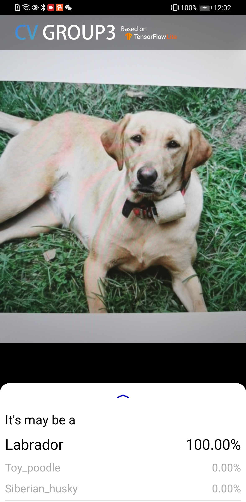

## Dog Breed Model Deployment
Here is the project of dog breed model deployment on android platform.
### File Information
|  File&Dir name   | Usage  |
|  ----  | ----  |
| android  | The android project can be import in android studio |
| model_automl  | The model we export from GCP AutoML |
| model_keras  | The model we designed, trained and converted |
| screenshots  | The applications screenshots |
| converter.py  | The tools to convert the h5 model file to tflite file |
| showdetail.py  | The tools can show the layers in detail of tflite file |

### Screenshots

### Demo video
https://youtu.be/HiQ375-DfqA

### Reference
- https://github.com/tensorflow/examples
- https://tensorflow.google.cn/lite/convert/python_api